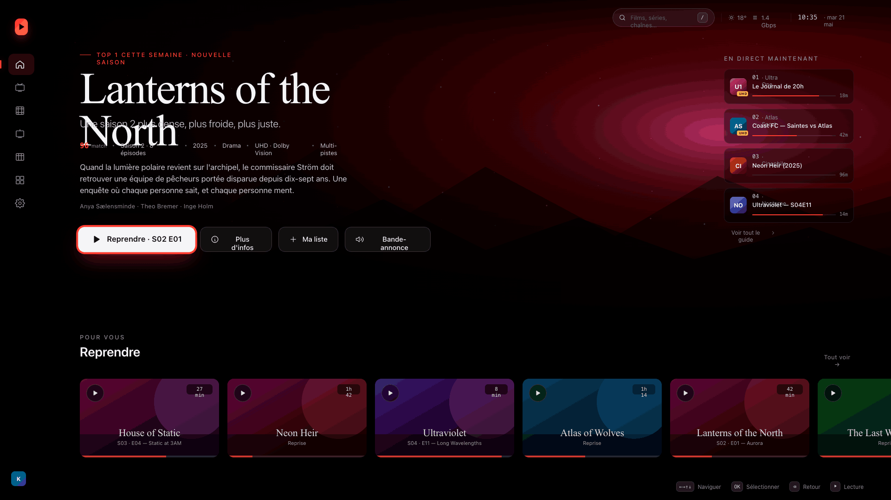

# Alpha Hosting TV

<p align="center">
  
</p>

<p align="center">
  <strong>Native Android TV / Google TV IPTV player.</strong><br/>
  Kotlin · Jetpack Compose · Compose-TV · Media3 · Room · Hilt
</p>

<p align="center">
  <a href="https://github.com/tobymilleragency-lgtm/alpha-hosting-tv-app/releases/latest/download/AlphaHostingTV-debug.apk">
    
  </a>
  <a href="LICENSE"></a>
  
  
  
</p>

---

## 🎨 New UI (2026 redesign)

Full editorial redesign — AMOLED-first, accent rouge `#FF3A2F`, typo **Instrument Serif** pour les titres + **Geist** / **Geist Mono** pour le reste.

<p align="center">
  
</p>

| Écran | Description |
|---|---|
| **Home** | Hero éditorial 720 dp · serif 84 sp · eyebrow accent · colonne "En direct maintenant" · rails Continue Watching 16:9 + Films / Séries / Chaînes |
| **Live TV** | Layout Tivimate 3 panes : catégories (accent pill) · chaînes (numérotation mono, logo dégradé hue) · **fenêtre preview** avec logo géant, chip `EN DIRECT`, cards now/next, CTA Regarder |
| **Films / Séries** | Hero featured + rails Netflix par catégorie · focus Apple-TV (scale 1.08 + ring accent) |
| **Detail** | Affiche 320×480 · serif 72 sp · meta accent · `94% match` · épisodes mono `S01E02` |
| **Guide TV** | Timeline 12 h × N chaînes · ruler mono · ligne `NOW` accent · cards programme avec chip `EN COURS` |
| **Recherche** | 2 panes : clavier d'écran 4×10 + récentes à gauche · chips de filtres + grille de résultats à droite |
| **Player** | Overlays minimaux : top bar transport, bottom controls big play + ring accent, **stats card** mono, **EPG drawer** zapping |
| **Settings** | Tabs sidebar 300 dp · section cards Surface1 + border · MAC card gradient accent · toggle, pills, color swatches |
| **Onboarding** | Wizard 3 steps · stepper accent · option Cloud (recommandée) vs Manuel · QR code stub |

Multi-View screen was removed in v1.0.0 — too few users, awkward focus on a single remote.

### Logo

<p align="center">
  
</p>

Logo "variant C" : dégradé rouge `#FF3A2F → #7A0E08`, trois ondes de diffusion qui émanent d'un point en bas à gauche, triangle play plein à droite. Installé en tant que `ic_launcher` adaptive + banner Android TV (320×180).

---

## What is Alpha Hosting TV?

Alpha Hosting TV is a **fully native** Android TV IPTV client. D-pad navigation is handled by Compose-TV's focus tree (no WebView bridges), playback uses Media3 / ExoPlayer for native codec support, and the whole catalog (channels, movies, series, EPG, history, favorites) lives in a local Room database. It speaks **Xtream Codes**, **M3U / M3U8** (URL or local file), and **Stalker Portal** out of the box.

A companion **Cloudflare Worker** (in `cloudflare-config/`) provides a MAC-based remote-config dashboard so users can provision their providers from a web browser and have the TV pull them in one click.

## Features

### Catalog & providers
- 🎬 **Xtream Codes** · **M3U URL** · **M3U file from local storage** · **Stalker Portal** with Live + VOD + series catalogues (MAC handshake + lazy `create_link` at play time, including movies)
- 🔁 **Multi-provider** — add as many as you want, pick the default in Settings (★ Default badge)
- 🚦 **De-duplication** — re-adding the same `(kind, url, username)` reuses the existing row instead of duplicating
- 🛰️ **Cloud sync via Cloudflare Worker** — paste your device MAC into the dashboard (login + password), add providers, then the app pulls them with one tap. App reads are anonymous (the MAC, hashed from `ANDROID_ID`, is the bearer); only dashboard mutations require the per-MAC password.
- ⏱️ **Background sync via WorkManager** (every 6 / 12 / 24 h, or every launch)
- 📈 **Live sync progress banner** pinned to the top of every screen during sync

### Live TV
- 📺 **Tivimate-style two-pane layout**: categories on the left, channels of the selected category on the right
- 🔢 Channel position numbers, logos, focus highlight, **now-playing + next-up programme** under each name (from cached EPG)
- 🏷️ **Categories management** (search, bulk Hide / Show, "Hide adult" preset, 🔒 / 🔞 markers)
- 🧹 Cleans decorative wrappers (`### FRANCE ###` → `FRANCE`) for display while keeping DB intact

### Movies / Series
- 🎞️ **Netflix-style rails by category** (top 25 per rail), hero banner with the featured title
- 🟦 Focus scale animation (1.0 → 1.08, 160 ms tween)
- 🔍 Cross-content **search** (debounced 220 ms): channels + movies + series, with **last-10 recent queries** as one-tap chips
- ★ **Favorites** (per kind, browsable from a dedicated screen)
- 📚 **Series episodes** loaded on demand — Xtream via `get_series_info` (per-season map), Stalker via `get_ordered_list?category=…`; played through Media3 (Stalker episodes resolve their `stalker://` URL via `create_link` at play time, exactly like channels and movies)

### Player
- ▶ **Media3 / ExoPlayer** — HLS, DASH, MPEG-TS, MP4 with hardware codec support
- 🎮 D-pad: BACK = exit, plus **Live**: ▲/▼ zap channels in the current category; **VOD**: ◀/▶ seek
- 🎚 **Subtitle + audio track selector** (VOD only) — reads Tracks from Media3, applies a TrackSelectionOverride
- 📋 **EPG drawer overlay** (Live only) — press OK / center to slide in a right-side channel list with now/next; D-pad picks a channel to zap to
- ⏸️ **Continue watching** (position recorded every 10 s + on dispose)
- 🚀 **Auto-play last watched on launch** option
- 🥷 **Open in external player** (VLC / MX / Just Player / Next Player) for codecs Media3 can't handle
- ⏺ **Record VOD** — from a movie's detail page, queue an OkHttp-backed download via WorkManager; progress visible on a Recordings screen; played locally once done (no external storage permission — saved under app-private external storage)
- 📐 **Aspect & speed** controls in the player toolbar — Fit / Fill / Zoom / 16:9 / 4:3 for picture, 0.5× / 1× / 1.25× / 1.5× / 2× for VOD playback speed
- 💤 **Sleep timer** (15 min · 30 min · 1 h · 2 h · cancel) — pauses + exits player at the deadline
- 📊 **Stream stats overlay** — resolution / video & audio codec / frame rate / bitrate / buffer ahead, toggled from the player overlay

### Discovery / Home
- 🏠 Dynamic Home: **Continue watching** (tap an item → Resume / Dismiss sheet), **Recently watched**, **Movies**, **Series**, **Featured channels** rails
- 🆕 **First-time MAC card**: shows your device MAC + dashboard steps when no provider is configured
- 🗓 **TV Guide grid** (Tivimate-style): 12 h × N channels timeline with "now" indicator, refreshed from the provider's full `xmltv.php` feed (streaming pull-parser handles 50 MB+ feeds)
- ▦ **Multi-View**: up to 4 channels simultaneously in a 2×2 grid

### Personalization
- 🎨 **3 themes**: Dark · AMOLED · Blue
- 📐 **Adaptive nav**: sidebar on tablets/TV (≥ 840 dp), top bar on medium widths (600–840 dp, also the user-selectable option in Settings), bottom bar on phones (< 600 dp). Phones / tablets ship from the same APK.
- 🌍 **Multi-language** UI: English / Français / Español / العربية + System (auto-detect). RTL layout direction flips automatically for Arabic. Translation table covers nav, home, settings and common buttons; the longer prose is still English for now.
- 🔄 **Boot autolaunch** — open Alpha Hosting TV automatically when the box finishes booting
- 🪟 **Picture-in-picture** — pressing Home while a stream plays shrinks the player into a corner (Android 8+)
- 🪜 **Onboarding wizard** on first launch — 3-step flow showing the device MAC and the two provider-adding paths
- 🔢 Show / hide channel numbers, hide adult categories beyond PIN, resume playback toggle, auto-play next episode

### Backup & state
- 💾 **Export / restore** providers + favorites + watch history as a single JSON file (Storage Access Framework picker)

### Security
- 🔐 **Parental PIN** (SHA-256, DataStore-backed) — auto-locks adult categories on each sync when a PIN is set
- 🔒 **Per-channel lock** — Settings → Manage locked channels lets you flag individual channels; play prompts for the PIN
- 🆔 **Stable per-device MAC** derived from `ANDROID_ID` (hashed) — never the real WiFi MAC

### Performance
- 🖼️ **Coil ImageLoader** with 25 %-heap memory + 256 MB disk cache (no re-downloads on scroll)
- 📦 **Chunked DB inserts** (500 rows / batch) during sync — flat memory on huge catalogs
- ⚡ **DB indices** on `(providerId, categoryId)` for fast category filtering
- 🎯 SQL-level filtering for Live TV per category (only the visible subset materialises)
- 🧱 **R8 / ProGuard release build** with resource shrinking — latest APK shipped is the release variant
- 📑 **Paging Room** for Movies / Series flat-grid (pages of 60, only ~120 items in memory regardless of catalog size)

### Distribution & updates
- 🇩 **Downloader code `5248504`** — initial sideload via the [Downloader app](https://www.aftvnews.com/downloader/) on any Android TV box.
- 🌐 GitHub Releases — latest APK at `releases/latest/download/AlphaHostingTV-debug.apk`.
- 🔄 **In-app self-update** (v1.0.5+) — the app pings GitHub Releases on launch, compares versionCode, and pops a dialog with a progress bar that downloads + installs the new APK via PackageInstaller. First update prompts once for "Install unknown apps"; subsequent updates are one-tap. No Play Store, no third-party updater required.

### Telemetry & crash reporting
- 🛰️ **Cloudflare Worker ingest** — every crash + ad-hoc `RemoteLog.info/warn/error/debug(...)` event is POSTed directly to the worker. No local crash.txt; no ADB pulls.
- 📒 **Crash dashboard** — `GET /crashes?token=…` returns an HTML page with expandable stack traces, device + version columns, 30-day rolling window.
- 🪵 **Event dashboard** — `GET /logs?token=…` table with level colouring (debug / info / warn / error), 7-day rolling window.
- 🔑 Token-gated via `env.CRASH_TOKEN` (fallback to `env.ADMIN_PASSWORD`). The app ships the URL + token baked in so every install reports automatically.

## Quick start

### Install on a TV box

1. Install the **Downloader** app on your Android TV box from Google Play.
2. Open Downloader, enter code **`5248504`**, press **Go**.
3. Allow install from unknown sources when prompted; install the APK.
4. On first launch, you'll see a **First-time setup** card with your device MAC.
5. Either:
   - Open **Settings** → tap **+ Xtream / + M3U URL / + M3U file / + Stalker portal** and fill in the form.
   - **Or** self-host the Cloudflare Worker, provision your MAC in its dashboard, then **Sync from cloud**.

From v1.0.5 onwards you only need Downloader for the *first* install — the app auto-updates itself from GitHub Releases.

### Build from source

```bash
git clone https://github.com/khalilbenaz/ultra-tv
cd ultra-tv/android-native

# JDK 17 is required (Android Gradle Plugin 8.7+)
export JAVA_HOME=$(/usr/libexec/java_home -v 17)   # macOS
./gradlew assembleDebug

# APK at app/build/outputs/apk/debug/app-debug.apk
```

For a smaller signed release build:

```bash
./gradlew assembleRelease
# ~8 MB APK at app/build/outputs/apk/release/app-release.apk
```

### Deploy the Cloudflare Worker (optional)

```bash
cd cloudflare-config
npm i -g wrangler

wrangler kv:namespace create CONFIG             # paste id/preview_id into wrangler.toml
wrangler kv:namespace create CONFIG --preview
wrangler secret put ADMIN_PASSWORD              # strong password — dashboard login
wrangler secret put CRASH_TOKEN                 # optional: rotate the crash-report token away from the admin one
wrangler deploy
```

The Worker URL printed by wrangler is what you paste in the app's Settings → **Change** next to the Worker URL field, and is also the host of the crash + event dashboards (`/crashes?token=…`, `/logs?token=…`).

If you fork the project, swap the hard-coded `WORKER_URL` + `TOKEN` constants in `android-native/.../RemoteLog.kt` and `UpdateChecker.kt` so your installs report to *your* worker, not the upstream one.

## Architecture

```
android-native/
├── app/src/main/kotlin/com/ultratv/tv/nativeapp/
│   ├── MainActivity.kt         (entry point + nav host)
│   ├── UltraTvApp.kt           (Hilt + Coil + WorkManager Configuration.Provider)
│   ├── BootReceiver.kt         (BOOT_COMPLETED → MainActivity)
│   ├── data/
│   │   ├── db/                 (Room entities + DAOs)
│   │   ├── xtream/             (Xtream Codes player_api.php client)
│   │   ├── stalker/            (Stalker Portal handshake + create_link)
│   │   ├── m3u/                (M3U/M3U8 parser, URL or text input)
│   │   ├── repo/               (Provider / Catalog / History / PlaybackContext / SyncStatusBus)
│   │   ├── sync/               (WorkManager SyncWorker + SyncScheduler)
│   │   ├── parental/           (PIN store, SHA-256)
│   │   ├── prefs/              (UserPreferences, HiddenCategoriesStore)
│   │   └── config/             (DeviceMac, RemoteConfigImporter)
│   ├── di/                     (Hilt modules: DB / Network)
│   ├── nav/                    (Routes catalog)
│   ├── RemoteLog.kt            (direct-to-Worker crash + event transport)
│   ├── update/                 (UpdateChecker + UpdateDialog — GitHub Releases self-update)
│   └── ui/
│       ├── theme/              (DesignTokens, ultraCardColors, palettes: AMOLED / Dark / Blue)
│       ├── components/         (SidebarNav, TopBarNav, UltraIcons — 28 stroke icons)
│       ├── common/             (PosterCard, ContentRail, HeroBanner, ChannelLogo, ContinueWatchingTile, NowPlayingMini)
│       ├── home/               (rails + MAC onboarding card)
│       ├── live/               (Tivimate 3-pane: categories | channels | preview window)
│       ├── movies/             (Rails view + Detail)
│       ├── series/             (Rails view + Detail with episodes)
│       ├── guide/              (12 h × N timeline grid with NOW accent line)
│       ├── search/             (on-screen keyboard + filter chips + grid)
│       ├── favorites/
│       ├── categories/         (Hide / Show + bulk)
│       ├── player/             (Media3 PlayerView wrapper)
│       └── settings/           (editorial header + section cards + AddProviderDialogs)
└── cloudflare-config/          (Worker: KV-backed config per MAC + crash & event dashboards)
```

## Roadmap

In active development / next iterations:

- 📊 **7-day xmltv** (current grid covers 12 h; longer window is a windowing change away)
- 🔍 **Full-text search index** (Room FTS4) — current LIKE is ok up to ~10k items
- 🧭 **Aggregated crash grouping** on the dashboard (currently one entry per occurrence; collapsing by stack fingerprint would scale better)

Recently landed:

- 🔓 **Anonymous worker sync (v1.0.8)** — the app no longer needs the per-MAC password to pull its config. The dashboard `/login` still gates mutations.
- 🎯 **Settings dialog focus (v1.0.8)** — text fields grab D-pad focus on dialog open and show an accent-tinted border so the cursor is visible.
- 🔁 **Update dialog loop fix (v1.0.8)** — local + remote versions are now compared on the same packed-semver scale; no more "update available" popping after every install.
- 🪟 **Auto-update via system installer (v1.0.6)** — switched from PackageInstaller sessions to `ACTION_VIEW` + FileProvider so the OS install activity handles the APK. Works on Fire TV, Mecool, vivo boxes that rejected the session path.
- 🩹 **Focus visibility + sidebar flicker (v1.0.7)** — `inverseOnSurface` flipped to near-black so TV Button/Card focus reads as a white pill with dark text instead of white-on-white. Sidebar labels gate on the animated width so returning via the left D-pad doesn't reflow text.
- 🎨 **2026 editorial redesign** of every screen — AMOLED-first, accent `#FF3A2F`, Instrument Serif + Geist typo, new variant-C launcher icon. See the *New UI* section above.
- 🛰️ **Remote crash + event reporting** to a self-hosted Cloudflare Worker (`POST /api/crash`, `POST /api/event`); HTML dashboards at `/crashes` and `/logs`. No more `crash.txt` hunting.
- 🔄 **In-app GitHub-Releases auto-update** with a download progress bar + PackageInstaller commit. After v1.0.5 the Downloader code is only needed for the very first install.
- 🩹 **LiveViewModel init-order NPE fix** that was crashing any nav to Live TV on some devices (Main.immediate dispatch + property declared after init).
- 📥 **HLS-segment recording** for Live channels (m3u8 polling + .ts append).
- 🌐 **Deep i18n EN / FR / ES / AR** across every screen — Home, Live, Movies/Series, Settings (incl. private dialogs and SAF toasts), Preferences, Categories, Onboarding wizard, Guide list + grid, Add-provider dialogs, parental PIN flow, Recordings, Search, Player overlays plus the rail-title fallback. ~270 keys, RTL-aware.
- 👆 **Touch UX**: vertical-drag gesture overlays for system volume (right strip, `🔊 nn%`) and screen brightness (left strip, `☀ nn%`); **pull-to-refresh** on Home, Live TV, Movies, Series and the Guide grid. Both inert under D-pad, so TV remote behaviour is unchanged.

## Credits

Alpha Hosting TV is based on Ultra TV, original work by [khalilbenaz](https://github.com/khalilbenaz). MIT-licensed.

The native Android TV codebase supersedes the earlier Capacitor WebView build (kept under `android-app/` and `web/` for historical reference — legacy, no releases produced from it, see [`android-app/README.md`](android-app/README.md)) — Compose-TV's focus tree gave reliable D-pad navigation on every box we tested, including the Mecool KM7 Plus where the WebView bridge approach struggled.

If you fork / repackage, please keep the credit visible in the About screen.

## License

MIT. See [LICENSE](LICENSE).

## Disclaimer

Alpha Hosting TV is an IPTV **client**, not a content provider. It does not include, host or distribute any stream. Use only playlists, EPG sources and credentials you are authorized to access in your jurisdiction.
